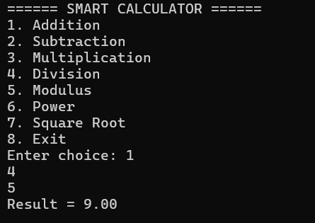
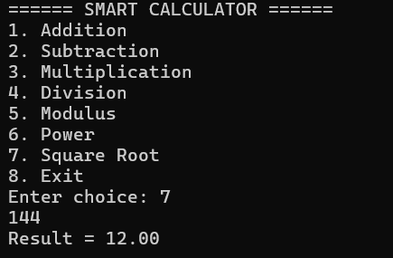
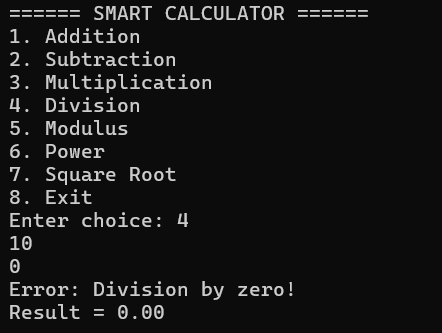

# 🧮 Smart Calculator in C

A menu-driven smart calculator written in C.  
This program performs basic arithmetic operations and advanced mathematical operations using modular programming.

---

## 🚀 Features
- Addition
- Subtraction
- Multiplication
- Division (with division-by-zero handling)
- Modulus operation
- Power calculation
- Square root calculation
- Continuous execution until user exits

---

## 🛠 Technologies Used
- C Programming Language
- GCC Compiler
- `stdio.h`, `stdlib.h`, `math.h`

---

## 📸 Output Screenshots

### ➤ Addition


### ➤ Square Root


### ➤ Error Handling


---

## ⚙ How to Compile and Run

```bash
gcc smartcalculator.c -o calculator -lm
calculator