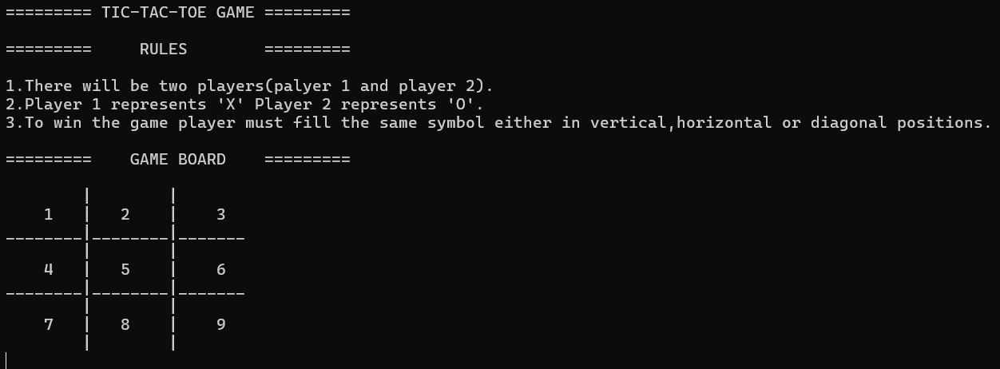
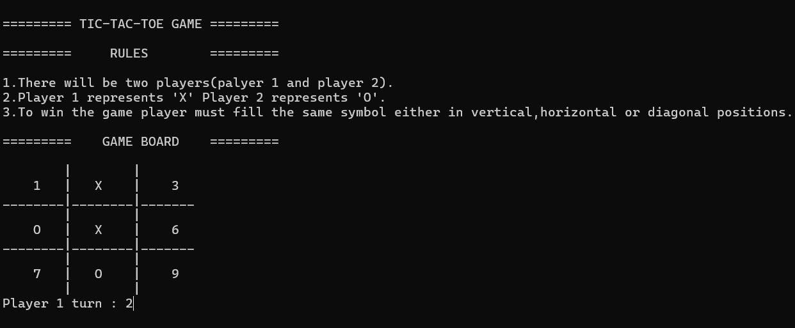
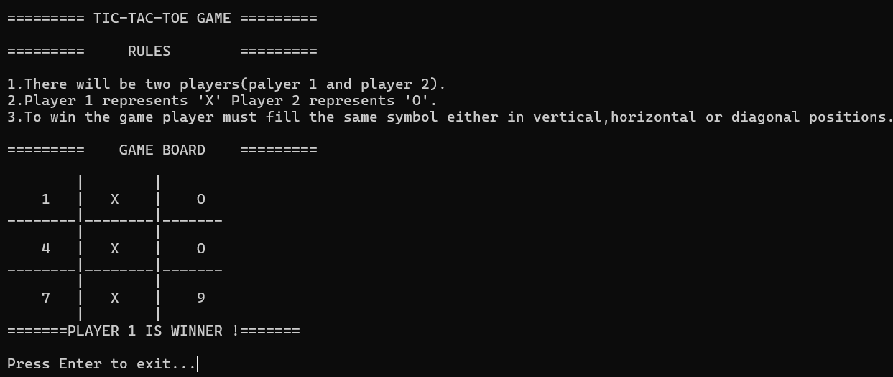
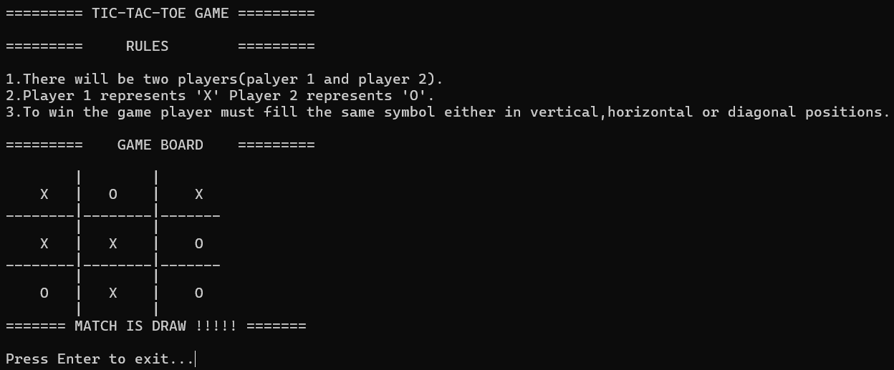

# 🎮 Tic Tac Toe Game in C

A simple two-player Tic Tac Toe game written in C.  
This program allows two players to play on the same computer with a text-based interface.

---

## 🚀 Features
- Two-player gameplay (Player 1: X, Player 2: O)  
- Dynamic board updates after every move  
- Validates moves to prevent overwriting  
- Detects winner or draw automatically  
- Continuous play until the players choose to exit  

---

## 🛠 Technologies Used
- C Programming Language  
- GCC Compiler  
- `stdio.h`, `stdlib.h`  

---

## 📸 Output Screenshots

### ➤ Game Start


### ➤ Player Move


### ➤ Winning Scenario


### ➤ Draw Scenario


---

## ⚙ How to Compile and Run

```bash
gcc tictactoe.c -o tictactoe -lm
tictactoe
